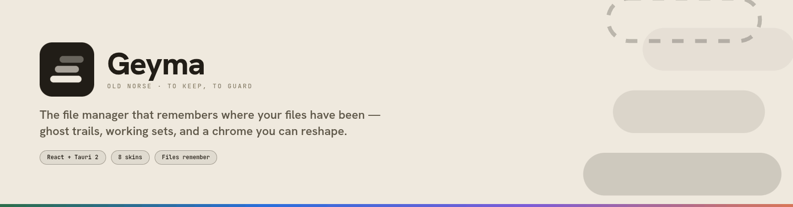
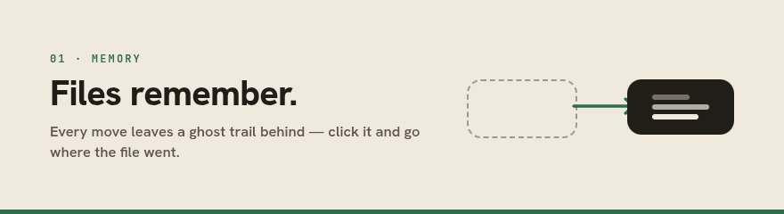
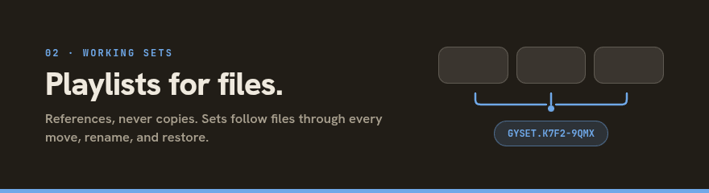
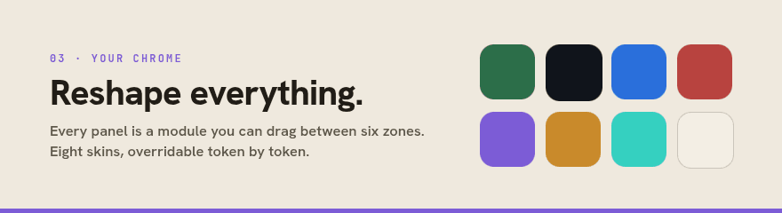
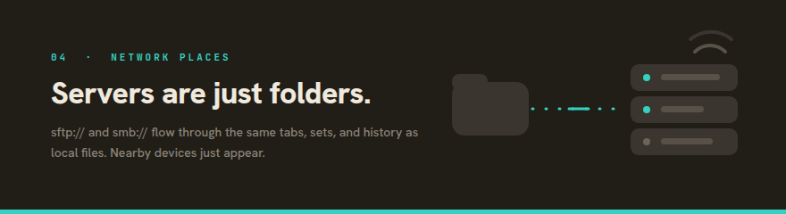
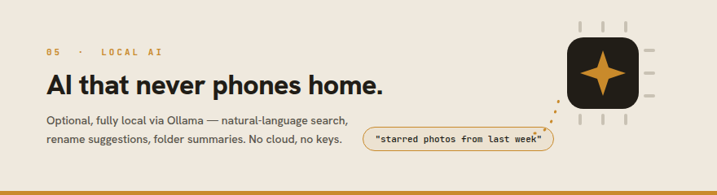

<p align="center">
  
</p>

<p align="center">
  <a href="LICENSE"></a>
  
  
  
</p>

<p align="center">
  <strong>Most file managers show you where your files are.<br>
  Geyma also knows where they've been, keeps living collections of them,<br>
  browses your servers like folders, and reshapes its entire chrome to how you work.</strong>
</p>

<p align="center">
  
</p>

<p align="center">
  <code>21 modules</code> · <code>6 zones</code> · <code>8 skins</code> · <code>8 layout presets</code> · <code>49 Rust commands</code> · <code>1 undo stack that actually undoes</code>
</p>

<br>



Every move, rename, star, and restore is logged — and that memory surfaces everywhere.
A per-file activity timeline in the Details panel (up to 200 events per file, each
location-changing event individually undoable). A disk-wide Timeline module. And
**ghost trails**: faint, dashed markers left behind in a folder showing where a file that
just left actually went. Click one and Geyma takes you straight there.

No more *"it was right here yesterday."* It was — and Geyma will show you where it went.

<br>



A **Working Set** is a playlist-like collection of file *references* — never copies. Files
stay exactly where they live on disk; the set just follows them through moves, renames,
trashing, and restoring. Make a set **smart** with a visual rule editor — kind, extension,
name, size, modified-within, starred, combined ALL/ANY, optionally scoped to specific
folders — or **hybrid**: your hand-picked items *plus* a rule's live matches. A saved
search becomes a smart set in one click.

Sets don't lose things quietly, either: a reference whose file has gone missing is
flagged with an amber badge and can be **relinked** ("Locate…") or removed. And any set
travels — export it as a compact `GYSET.` clipboard code or a versioned `.gyset` file;
items, rule, note, color, and icon all round-trip.

<br>



There is no fixed layout. Every piece of UI — nav, search, sidebar panels, even the file
grid itself — is a **module** you can drag between six layout zones, resize, hide, or
bring back from the edit bar. Eight layout presets (Classic, Focus, Commander,
Dashboard, …) to start from, and eight full color skins, each overridable **token by
token**: accent, font, radius, density, glow, background pattern.

<p align="center">
  
</p>

<br>



`sftp://` and `smb://` paths flow through the exact same navigation, tabs, history —
even working sets — as local ones. Save a connection, browse a NAS like it's Home, drag
files between local and remote panes. Passwords live **only in the OS keyring**, strictly
opt-in; the Network panel even **discovers nearby SMB devices** (mDNS/DNS-SD) and lists
their shares as a clickable tree, so connecting to the office NAS is two clicks, not a
form.

Remote scope is honest by design: what can't work over the wire (Trash, symlinks,
permissions, extract-in-place) is hidden or fails with a clear message — never silently.

<br>



Entirely optional, entirely local, via [Ollama](https://ollama.com) — no cloud calls, no
API keys. Geyma can install Ollama for you (elevated via `pkexec`, install log streamed
into the UI), start/stop the server, and pull models with live progress. Three features,
each individually toggleable: **natural-language search** ("starred photos from last
week" → real filters), **batch-rename suggestions**, and on-demand **folder summaries**.

## A closer look

<table>
<tr>
<td width="50%">

<p align="center"><em>Eight skins, light or dark — here, Obsidian</em></p>
</td>
<td width="50%">

<p align="center"><em>List view with sortable columns</em></p>
</td>
</tr>
<tr>
<td width="50%" colspan="2">

<p align="center"><em>Quick Look — Space to preview, arrow keys to step through the folder</em></p>
</td>
</tr>
</table>

## Everything you'd expect, too

Real file management, backed by Rust:

- **Organize** — tabs (`Ctrl+T`, `Ctrl+1`–`9`), dual-pane split, cut/copy/paste with
  collision-safe naming, drag-and-drop moves, duplicate, batch rename (pattern +
  numbering, live preview, undoable), symlinks, and a Properties dialog with an editable
  unix-permissions matrix.
- **Stay safe** — a recoverable Trash that restores to the exact origin (even across
  restarts), double-press-to-confirm permanent deletes, a 20-deep undo stack where every
  operation pushes its real inverse, and no silent overwrites anywhere.
- **Archives** — extract ZIP, tar (`.tar.gz` / `.bz2` / `.xz`), and 7z with pure-Rust
  readers; preview archive contents without extracting; compress any selection to ZIP.
  Extraction is guarded against zip-slip and zip bombs.
- **Find** — search-as-you-type, recursive "All" scope, kind/starred filter chips, a
  duplicates spotter, and stars on anything.
- **Preview** — Quick Look for images, audio/video (with GStreamer preflight and
  per-distro fix-it hints), PDF, syntax-highlighted code, archives, and folders.
- **Fail gracefully** — every error carries a stable code translated into plain
  language; folder-load failures show a Retry, a crashing panel degrades to just that
  panel, and toasts stack, dedupe, and never break the layout.

The full list — every shortcut, module, and setting — lives in
[**docs/FEATURES.md**](docs/FEATURES.md).

## Under the hood

- **React 18 + TypeScript + Vite** for the UI, one **Zustand** store split into domain
  slices, all user-facing strings in an **i18n catalog** (react-i18next).
- **Tauri 2** as the desktop shell — filesystem, archive, media, network, and AI
  operations are 50 Rust commands with unit test coverage.
- **Two filesystem backends behind one interface**: the real Rust one, and a **mock
  in-memory filesystem** (including simulated SFTP/SMB servers) that kicks in
  automatically in a plain browser — `npm run dev` needs no Rust toolchain, and it's
  what the screenshots above are running.
- **Security posture**: IPC name params validated against path traversal, archive
  extraction sandboxed against zip-slip and bombs, the preview media server locked to a
  constant-time token + anti-DNS-rebinding host check, remote passwords only in the OS
  keyring, SFTP host keys pinned on first use (a changed server identity blocks the
  connection until explicitly re-trusted). Known gaps are tracked honestly in
  [docs/AUDIT.md](docs/AUDIT.md) — currently the webview CSP.

## Getting started

Packaged early-access builds (`.deb` / `.rpm` / AppImage) are published on the
[releases page](https://github.com/MadsenDev/geyma-file-manager/releases). Geyma is
pre-1.0: keep backups of anything irreplaceable, and use the issue templates to report
anything strange.

To run from source:

```bash
npm install

# Frontend only, in a browser, backed by the mock filesystem — no Rust needed
npm run dev

# Full desktop app with real filesystem access (requires Rust + WebView deps)
npm run tauri dev
```

Building the native shell requires the [Tauri prerequisites](https://v2.tauri.app/start/prerequisites/)
for your OS (on Linux: `webkit2gtk`, `libayatana-appindicator3`, `librsvg2` development
packages, on top of a Rust toolchain).

```bash
npm run build           # typecheck + build the frontend bundle
npm run typecheck       # TypeScript only
npm run tauri build     # .deb and .rpm bundles (needs native deps above)

cd src-tauri && cargo test   # Rust unit tests (fsops, archives, remote parsing, previews)
```

Arch Linux is packaged via [`packaging/arch/PKGBUILD`](packaging/arch/PKGBUILD) — build it
with `makepkg -si`. AppImage is buildable on demand with
`npm run tauri build -- --bundles appimage`.

## Project layout

```
src/
  state/       one zustand store, split into slices/ (nav, fileOps, sets, remote, ai, …)
  fs/          FsBackend interface + Tauri, mock, and remote-path implementations
  theme/       8 skin token sets + resolver, ThemeContext
  layout/      the zone/module layout engine (Zone, ModuleShell, EditBar)
  modules/     one component per module (files/, nav, search, sets, network, …)
  overlays/    Quick Look (quicklook/), context menu, modals, toasts
  i18n/        the full string catalog (en.json) + react-i18next setup
  lib/         errors, formatting, gyset codec, keyboard shortcuts
src-tauri/     Rust shell: fsops, archives, preview, media, remote/ (sftp, smb,
               discovery), ai, and the shared CmdError type
packaging/     Arch PKGBUILD
website/       static landing page, deployed to GitHub Pages
docs/          FEATURES.md (full feature reference) · AUDIT.md (known gaps)
design/        the v3.2 design handoff this rewrite implements
```

## Roadmap

Still open, per the design spec and [audit](docs/AUDIT.md): workspace snapshots, binding
a look/layout snapshot to a working set, a user-editable bookmarks group in the sidebar,
and a real webview CSP. RAR stays deliberately unsupported until a mature pure-Rust
reader exists.

<p align="center">
  
</p>
