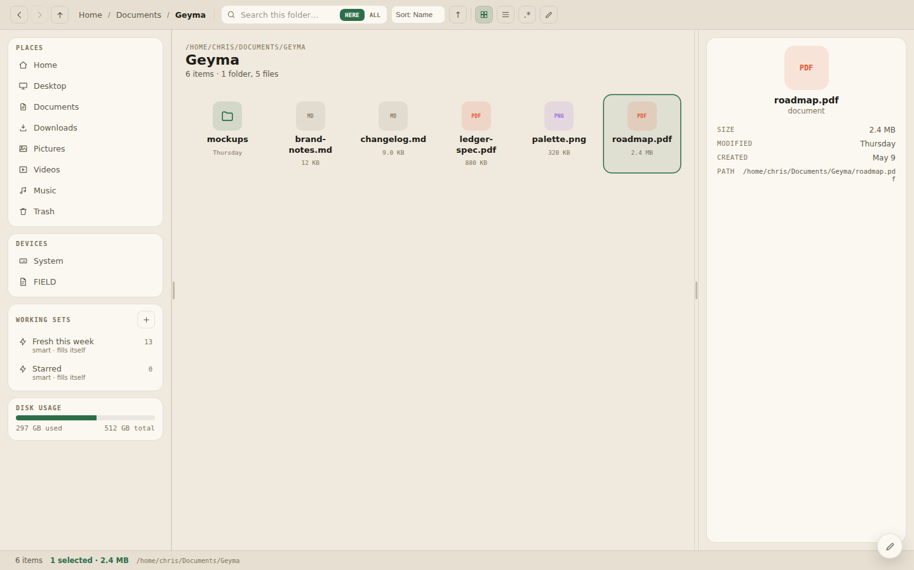
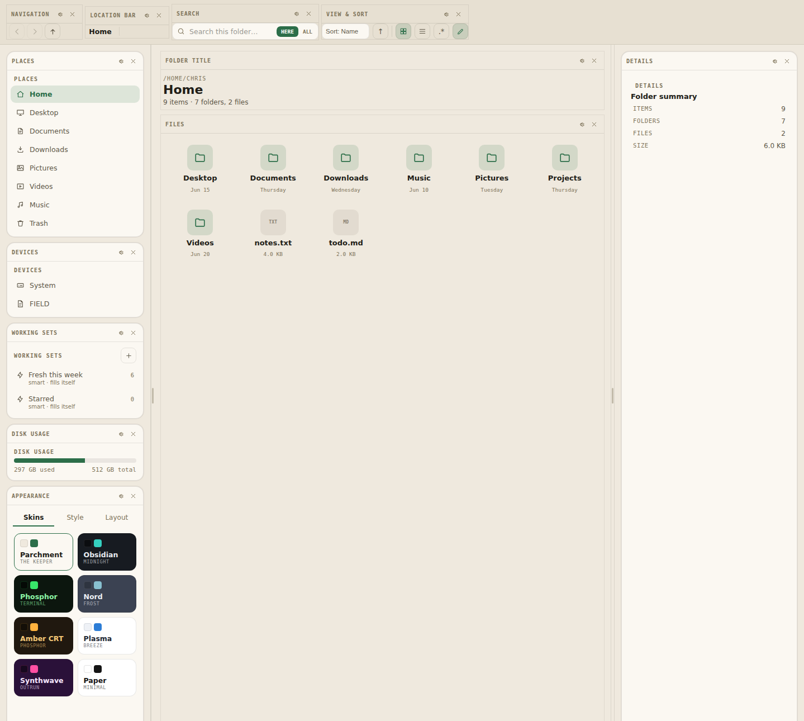
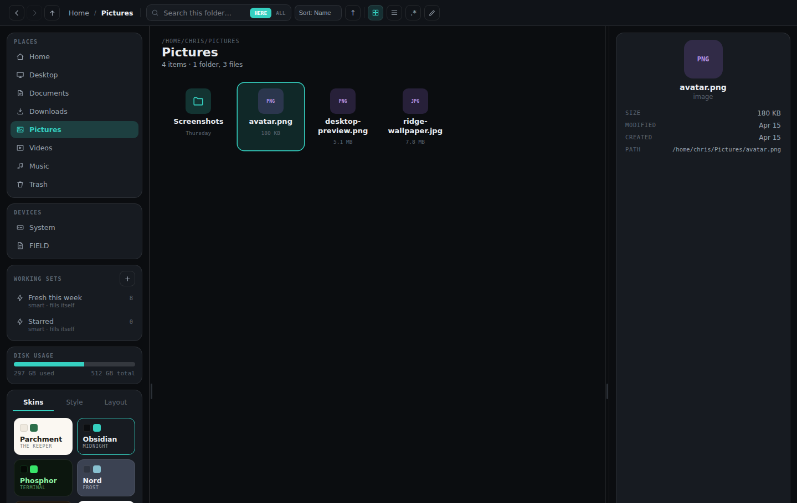
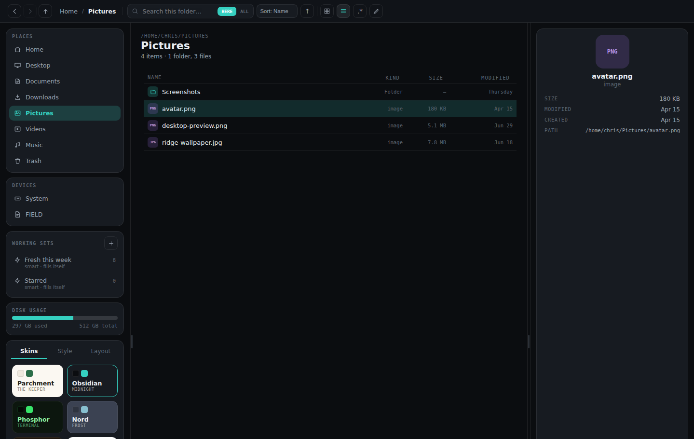
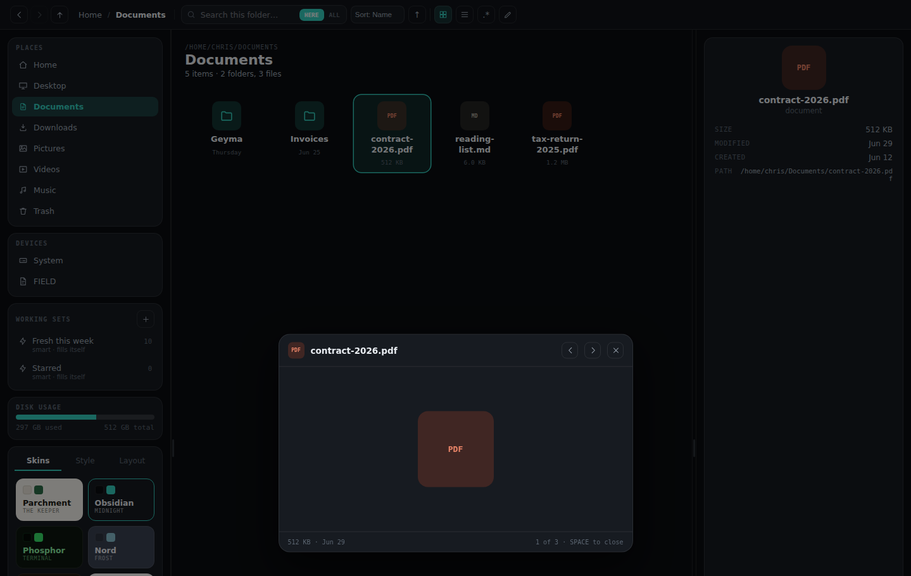

<p align="center">
  
</p>

# Geyma

**A desktop file manager that remembers where your files have been, keeps living playlists
of them, and reshapes itself to however you want to work.**

[](LICENSE)


Geyma (Old Norse: *to keep, to guard*) is a from-scratch rewrite of a PySide6 file manager,
now built as a React + TypeScript app inside a Tauri 2 shell with real filesystem access —
list, rename, move, copy, a recoverable Trash, and disk usage, all backed by Rust.

<p align="center">
  
</p>

## Why Geyma is different

### 🕰️ Files remember

Every move, rename, star, and restore is logged. That memory surfaces everywhere: a
per-file activity timeline in the Details panel, a disk-wide Timeline module, and **ghost
trails** — faint, dashed markers left behind in a folder showing where a file that just
left actually went. Click one and it takes you straight there.

### 📎 Working Sets

Playlist-like collections of file *references*, never copies. Files stay exactly where they
live on disk; a set just follows them through moves, renames, trashing, and restoring. Sets
can carry a note, or be **smart** — a rule (`starred`, `kind`, `modified since…`) that fills
the set live from the whole disk instead of a fixed list. Share a set with anyone as a
`GYSET.` code.

### 🎨 Deep customizability

The entire chrome is modular. Every piece of UI — nav, search, sidebar panels, even the
file grid itself — is a module you can drag between six layout zones, hide, or bring back
from the edit bar's chip strip. Eight full color skins, each overridable token-by-token
(accent, font, radius, density, glow, background pattern).

<p align="center">
  
</p>

## A closer look

<table>
<tr>
<td width="50%">

<p align="center"><em>Eight skins, light or dark — here, Obsidian</em></p>
</td>
<td width="50%">

<p align="center"><em>List view with sortable columns</em></p>
</td>
</tr>
<tr>
<td width="50%" colspan="2">

<p align="center"><em>Quick Look — Space to preview, arrow keys to step through the folder</em></p>
</td>
</tr>
</table>

## Under the hood

- **React 18 + TypeScript + Vite** for the UI
- **Zustand** for application state
- **Tauri 2** as the desktop shell — real filesystem access (list/rename/move/recursive copy,
  a recoverable app-level Trash, disk usage) via Rust commands in `src-tauri/src/fsops.rs`
- A **mock in-memory filesystem** (`src/fs/mockBackend.ts`) kicks in automatically when the
  app runs in a plain browser (`npm run dev` without the Tauri shell), so the UI can be
  developed and demoed without the native shell — it's what the screenshots above are running.

## Getting started

```bash
npm install

# Frontend only, in a browser, backed by the mock filesystem — no Rust toolchain needed
npm run dev

# Full desktop app with real filesystem access (requires Rust + platform WebView deps)
npm run tauri dev
```

Building the native shell requires the [Tauri prerequisites](https://v2.tauri.app/start/prerequisites/)
for your OS (on Linux: `webkit2gtk`, `libayatana-appindicator3`, `librsvg2` development
packages, on top of a Rust toolchain).

```bash
npm run build          # typecheck + build the frontend bundle
npm run typecheck       # TypeScript only
npm run tauri build     # .deb and .rpm bundles (needs native deps above)
```

Arch Linux is packaged separately via [`packaging/arch/PKGBUILD`](packaging/arch/PKGBUILD)
(a `-git` VCS package, since no tagged releases exist yet) — build it with `makepkg -si`.
AppImage isn't part of the default build; it's still buildable on demand with
`npm run tauri build -- --bundles appimage`.

## Project layout

```
src/
  state/       zustand store, layout model (zones/modules), shared types
  theme/       skin tokens + resolver, ThemeContext
  fs/          FsBackend interface + Tauri and mock implementations
  layout/      the zone/module layout engine (Zone, ModuleShell, EditBar)
  modules/     one component per module (files, nav, search, sets, appearance, …)
  overlays/    Quick Look, context menu, toast, modals
  icons/       inline stroke-SVG icon set
src-tauri/     Rust shell: window config + filesystem commands
archive/       the previous PySide6 implementation (reference only, not built)
design/        the v3.2 design handoff this rewrite implements
```

## Status

The zone/module layout engine, skin/token system, and core modules (files grid/list, nav,
location, search, view switch, title, places, devices, status, details, appearance, sets,
disk, recent, timeline, duplicates, clock, visualizer, folder mood, second pane, Quick Look,
ghost trails) are implemented against real filesystem data. Cut, copy/paste, duplicate, ZIP
extraction, and batch rename (pattern + numbering, undoable) are all wired to the real FS
(copy and extraction are recursive Rust commands), working-set references stay correct
across every operation (move/rename/trash/restore/permanent delete), and set share codes
round-trip full set data (items, rule, smart, note). `src-tauri` has unit test coverage for
the filesystem commands (move/copy/rename/trash/restore/delete/extract, including a zip-slip
guard) and archive/text preview parsing; the frontend has none yet. `npm run tauri build`
produces working `.deb` and `.rpm` bundles; AppImage bundling depends on a GitHub release
download that may be blocked in restricted network environments. Still open, per the design
spec: workspace (full environment) snapshots, binding a look/layout snapshot to a working
set, and non-ZIP archive formats (tar/rar/7z), tabs, and network protocol (smb/sftp) support.
